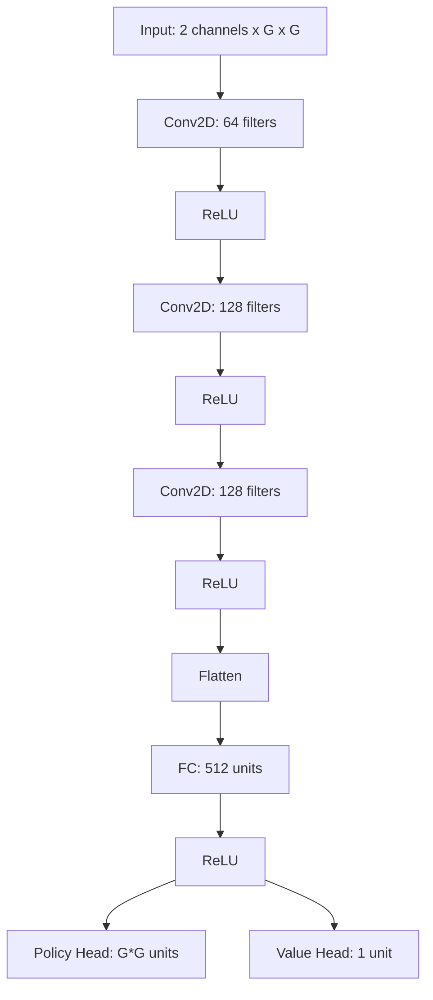

# Chain Reaction AI Benchmark Results

## Model Architecture

The model (PPOGridNet) is a deep neural network specifically designed for the Chain Reaction game. It combines convolutional layers for spatial feature extraction with fully connected layers for policy and value prediction. The architecture is grid-size independent, allowing the convolutional weights to be reused for larger grid sizes.

Key components:
- **Input Layer**: Takes a 2-channel grid representation (G x G)
- **Convolutional Layers**: 
  - 3 Conv2D layers with ReLU activation
  - Channel progression: 2 → 64 → 128 → 128
  - Kernel size: 3x3 with padding=1 to maintain grid dimensions
- **Fully Connected Layers**:
  - Flattened conv output → 512 units
  - ReLU activation
- **Dual Heads**:
  - Policy Head: Outputs action logits (G*G units)
  - Value Head: Outputs state value (1 unit)

## Training Process

The training process was conducted in multiple phases to progressively improve the model's performance:

1. **Initial Training vs Random Opponent**
   - Model was first trained against random opponents
   - Established basic gameplay understanding
   - Learned fundamental strategies

2. **Training vs Mixed Policy Pool**
   - Expanded training against a diverse set of policies
   - Policies were randomly sampled during training
   - Helped model adapt to different playing styles

3. **Top-5 Strategy Implementation**
   - Implemented a sophisticated training regime
   - Only sampled opponents from top 5 based on ELO ratings
   - Included model checkpoints in the opponent pool
   - Ensured continuous improvement against strong opponents

## Benchmark Results

The model demonstrates strong performance across different opponent types:

- **vs Random Opponents**: ~96% win rate
- **vs Custom Policy (Gemini)**: ~96% win rate
- **vs ChatGPT-4**: 93% win rate

### Training Metrics

The model was trained on a 5x5 grid but the convolutional weights can be reused for larger grid sizes, making it adaptable to different game configurations.
